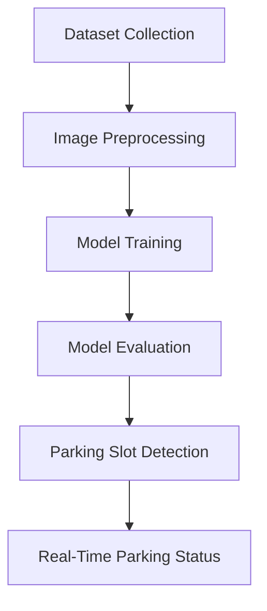

<div align="center">

# 🚗 Smart Parking System using Deep Learning 🅿️
### *AI-Powered Real-Time Parking Space Detection*


---

### 🔥 Intelligent Parking Detection using CNN Architectures  
**MobileNetV2 • ResNet • ResNet50 • InceptionV3 • VGG16**

</div>

---

# 📌 Overview

The **Smart Parking System** is an AI-based solution developed to automate parking slot detection using **Deep Learning** and **Computer Vision** techniques.

This project helps:

✅ Reduce traffic congestion  
✅ Detect available parking slots in real-time  
✅ Improve urban mobility  
✅ Reduce fuel consumption and pollution  
✅ Support Smart City infrastructure

The system compares multiple CNN architectures and identifies the most efficient model for real-time parking management.

---

# 🧠 Models Compared

<div align="center">

| 🔍 Deep Learning Model | 🎯 Accuracy | ⚡ Performance |
|------------------------|-------------|----------------|
| **MobileNetV2** | **97%** | ⭐ Best |
| ResNet | 96.42% | Excellent |
| InceptionV3 | 94.1% | Very Good |
| VGG16 | 73% | Moderate |
| ResNet50 | 72% | Moderate |

</div>

---

# 🏆 Best Performing Model

<div align="center">

## 🥇 MobileNetV2

✨ Lightweight Architecture  
✨ Faster Processing Speed  
✨ Low Computational Cost  
✨ Real-Time Detection Support  
✨ Best for Edge Devices & Smart Systems

</div>

---

# 🚀 Features

```diff
+ Real-time parking slot detection
+ Deep Learning based image classification
+ Multiple CNN architecture comparison
+ Fast and lightweight model deployment
+ Smart parking occupancy monitoring
+ Efficient urban traffic management
````

---

# 🛠️ Tech Stack

<div align="center">

| Technology         | Usage                 |
| ------------------ | --------------------- |
| Python             | Core Programming      |
| TensorFlow / Keras | Deep Learning         |
| OpenCV             | Image Processing      |
| NumPy              | Numerical Computation |
| Matplotlib         | Visualization         |
| CNN Models         | Classification        |

</div>

---

# 🧩 CNN Architectures Used

```python
✔ MobileNetV2
✔ ResNet
✔ ResNet50
✔ InceptionV3
✔ VGG16
```

---

# 📂 Project Structure

```bash
Smart-Parking-System/
│
├── dataset/
│   ├── occupied/
│   └── empty/
│
├── models/
│   ├── MobileNetV2/
│   ├── ResNet/
│   ├── ResNet50/
│   ├── InceptionV3/
│   └── VGG16/
│
├── training/
│   ├── train.py
│   └── evaluate.py
│
├── app/
│   └── parking_detection.py
│
├── results/
│   ├── graphs/
│   └── reports/
│
└── README.md
```

---

# ⚙️ Working Process

<div align="center">



</div>

---

# 📊 Performance Analysis

## 🔹 MobileNetV2

* Lightweight & optimized
* High speed inference
* Low memory consumption
* Best accuracy (97%)

## 🔹 ResNet

* Strong feature extraction
* Good performance
* Slightly higher computation

## 🔹 InceptionV3

* Advanced object recognition
* Good accuracy
* More resource intensive

## 🔹 VGG16

* Deep architecture
* High memory usage
* Lower real-time efficiency

## 🔹 ResNet50

* Robust model
* Higher computational complexity

---

# 🌍 Real-World Applications

✅ Smart Cities
✅ Shopping Malls
✅ Airports
✅ Universities
✅ Office Campuses
✅ Public Parking Areas

---

# 🔮 Future Enhancements

```yaml
Future Scope:
  - IoT Sensor Integration
  - Mobile App Support
  - Cloud Analytics Dashboard
  - Live Parking Map
  - Automatic Number Plate Recognition
  - Smart Payment Gateway
```

---

# 📈 Research Contribution

This project demonstrates how **Deep Learning** can optimize smart parking systems by comparing multiple CNN architectures.

The research concludes that:

> 🏆 **MobileNetV2 outperforms heavier CNN models in real-time parking applications due to its speed, efficiency, and lightweight architecture.**

---

# 👨‍💻 Author

<div align="center">

## NS LAKSHMI CHARITH

🌐 GitHub:
[https://github.com/Lakshmicharith](https://github.com/Lakshmicharith)

💼 LinkedIn:
[https://linkedin.com/in/LakshmiCharith](https://www.linkedin.com/in/lakshmi-charith-91694025a/)

</div>

---

# 📚 References

* Deep Learning for Smart Parking Systems
* CNN-based Vehicle Detection Research
* TensorFlow Documentation
* OpenCV Computer Vision Documentation
* Smart City AI Solutions

---

<div align="center">

# ⭐ If you like this project, don't forget to STAR the repository ⭐

### 🚀 “Building Smarter Cities with AI & Deep Learning”

</div>
```
